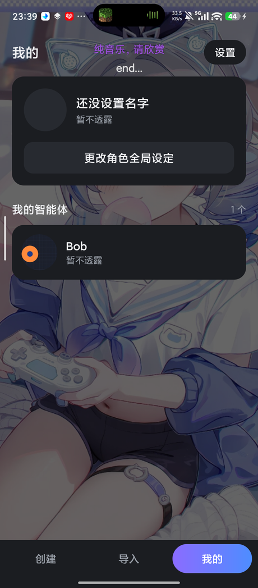
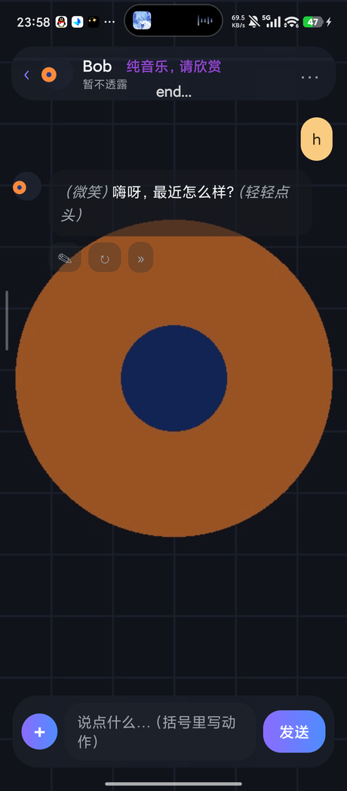

# 遐语 · Reverie

**一个本地优先的 Android 角色扮演聊天客户端。**

自己捏角色、自己接模型、所有数据只存在你这台手机上 —— 不登录、不上传、不联网（除非你自己配了在线接口）。

界面全部用原生 `View` 手写绘制，**不依赖 AndroidX、不依赖 Gradle、没有任何第三方库**，
整个 App 编译完不到 1 MB。

<p align="center">
  
  
</p>

---

## 功能

### 角色（智能体）
- 创建任意多个角色，每个角色可以设置 **名称 / 性别 / 人物设定 / 简介 / 开场白 / 谨记**
- 角色主图（大图，做背景用）+ 1:1 头像，头像可以从主图里拖框裁剪
- 「谨记」是给模型看的硬约束（不会显示在角色介绍里）；「简介」是对外展示的
- 每个角色的「你」可以单独设置：默认用全局的用户设定，也可以给这个角色配一份专用的

### 对话
- 流式之外的常规请求；支持**图文一起发**（图片存在手机本地、聊天里能看到）
- **长按任意一条消息**：复制 / 改写 / 继续说 / 重新说 / 撤回
  - **改写**：把你刚说的那句改掉，然后重新生成回复
  - **继续说**：让角色顺着上一句再冒一条出来，不重复已经说过的
  - **重新说**：底部弹层一次列 4 个候选，一页一页翻，挑一个用（像星野）
  - 只有「各自最后一条」才给扩展菜单，更早的消息只能复制 / 撤回
- 每个角色独立的聊天记录，退出重进还在
- 一次请求只带最近 N 轮上下文，不会越聊越慢

### 角色卡导入导出
- 一键把角色打包成 **zip** 发给朋友，朋友用「导入」读进去就能直接用
- 也能**只导出聊天记录**（两个纯文本，按全局句序排好，谁说的看它在哪个文件里）
- 导入做了容错：认 `agent.json`，没有就按文件名/序号猜那几个 txt；
  图片按「名字带 avatar/头像 的是头像，剩下最大的那张是主图」来判断
  → 别的软件导出的角色卡也大概率能读进来

### 外观
- **深色 / 浅色**两套配色，一键切换
- **自定义背景图**：随便选一张图做整个软件的背景（居中裁剪、不拉伸），
  主题色会**从背景图里自动提取**（背景图缩小模糊后出现最多的那个颜色）
- **毛玻璃**开关：面板半透明 + 背景高斯模糊（Android 12+ 走原生 `RenderEffect`）
- 沉浸式：内容延伸到状态栏 / 导航栏后面，系统栏透明
- 导航是底部三入口（创建 / 导入 / 我的），不是抽屉，**没有侧边栏动画**

### 接口
- 兼容 **OpenAI 格式**的任意接口：自己填 `baseUrl` / `apiKey` / `model` / `temperature`
- 内置两条通道：
  - **免费公共接口** —— `text.pollinations.ai`，不用填 key，但**不稳定、随时可能挂**
  - **限时通道** —— 指向你自己电脑上跑的 OpenAI 兼容服务（作者本机是 `192.168.1.2:8000`，跑 qwen3-14b）
    → **换成你自己的局域网 IP** 才能用
- 网络错误做了人话翻译（限流 / 超时 / key 不对 / 余额不足…），限流和临时故障会自动重试

### 内容分级
- **R18+ 开关**默认关闭；开启前必须先过一页免责声明，**停满 10 秒**「同意」才可点
- 关掉之后，成人向的提示词不会进 system prompt

### 隐私
- 角色、图片、聊天记录、API key 全部存在 App 私有目录，**不上传任何服务器**
- 没有账号系统、没有统计、没有广告 SDK、App 里没有一行联网代码是为了「回传」的
- 唯一的网络请求就是你自己配的那个模型接口

---

## 安装

到 [Releases](https://github.com/TwilightFY801/Reverie/releases) 下载 `Reverie-*.apk`，
传到手机上点安装（需要允许「安装未知应用」）。

- 最低 Android 7.0（`minSdk 24`），目标 Android 14（`targetSdk 34`）
- 只有 `INTERNET` 和 `ACCESS_NETWORK_STATE` 两个权限
- 大小约 940 KB

---

## 自己编译

**不需要 Android Studio，也不需要 Gradle。** 装好 JDK 和 Android SDK 的命令行工具就能编：

```bash
# 需要：JDK 17+、Android SDK（platforms/android-34 + build-tools/35.0.0）
python build.py

# 指定版本号 / 产物路径
python build.py --version 1.2.0 --out dist/Reverie.apk

# 保留调试信息（默认是 --release，会做裁剪和优化）
python build.py --debug
```

脚本干的事就是 Android 官方工具链走一遍：

```
aapt2 compile  ->  aapt2 link  ->  javac  ->  d8
              ->  塞 classes.dex  ->  zipalign  ->  apksigner
```

环境变量（都可以不设，脚本会自己去常见位置找）：

| 变量 | 说明 |
|---|---|
| `JAVA_HOME` | JDK 目录 |
| `ANDROID_SDK_ROOT` / `ANDROID_HOME` | Android SDK 目录 |
| `REVERIE_KEYSTORE` | 签名密钥，默认 `keystore/release.keystore`（不存在会自动生成一份） |
| `REVERIE_KS_PASS` / `REVERIE_KS_ALIAS` | 密钥库口令 / 别名，默认 `android` / `reverie` |

> ⚠️ **签名密钥不进仓库**（`.gitignore` 里挡掉了）。
> 自己生成的密钥第一次签名出来的 App 跟 Release 里的**签名不同**，
> 想覆盖安装得先卸载旧版本。密钥丢了就没法给已装的用户升级，自己保管好。

### 目录结构

```
Reverie/
├── build.py                 构建脚本（免 Gradle）
├── app/
│   ├── AndroidManifest.xml
│   ├── res/                 图标 / 主题 / 字符串
│   └── src/com/twilight/zhiyu/
│       ├── MainActivity.java       外壳：创建 / 导入 / 我的
│       ├── ChatActivity.java       聊天页（气泡、长按菜单、重说弹层）
│       ├── CreateActivity.java     创建 / 编辑角色
│       ├── AgentFormView.java      角色表单（三个 Activity 共用）
│       ├── SettingsActivity.java   设置
│       ├── ApiActivity.java        API 通道管理
│       ├── ApiEditActivity.java    添加 / 编辑一条通道
│       ├── ProfileEditActivity.java 用户设定
│       ├── UserProfileActivity.java 全局 / 角色专用设定切换
│       ├── R18Activity.java        R18+ 免责声明
│       ├── CropActivity.java       1:1 头像裁剪
│       ├── AboutActivity.java      关于
│       ├── Store.java              数据存储 + 内置通道 + 图片私有目录
│       ├── Model.java              纯数据模型
│       ├── Net.java                OpenAI 兼容请求 + system prompt 拼装
│       ├── ZipPack.java            角色卡 zip 导入 / 导出
│       ├── UI.java                 自绘 UI 工具库（主题 / 布局 / 弹层 / 毛玻璃）
│       └── GlassView.java          毛玻璃采样视图
├── examples/
│   └── example-agent.zip    示例角色卡（可直接导入）
└── screenshots/
```

---

## 角色卡格式

就是一个 zip，里面这么放：

```
agent.json        完整数据（优先读这个）
1_姓名性别.txt     姓名 + 性别
2_设定.txt         人物设定
3_简介.txt         简介
4_开场白.txt       开场白
5_谨记.txt         谨记（可选）
image.jpg         角色主图
avatar.jpg        1:1 头像
```

`agent.json`：

```json
{
  "format": "zhiyu-agent/1",
  "name": "白露",
  "gender": "女",
  "persona": "你叫白露，24 岁，在一家小出版社做插画……",
  "memo": "说话前常有一小段停顿，用「……」表示。",
  "bio": "出版社插画师，习惯熬夜赶稿，说话慢悠悠的。",
  "greeting": "（把画笔搁在调色盘边）……来啦。"
}
```

只有 `agent.json` 也能导入；只有那几个 txt 也能导入（会按文件名和序号猜）；
没有图片也行（头像留空，之后自己补）。

`examples/example-agent.zip` 就是一个能直接导入的完整例子。

---

## 已知限制

- **图片不会真的发给模型**：聊天里的图片只存在手机本地用于显示，
  发给接口时用 `[发来一张图片]` 占位（省流量，也避免大部分接口不支持多模态）
- 没有流式输出，回复是一次性返回的
- 内置的「免费公共接口」是第三方公益服务，随时可能限流或下线，别当稳定方案
- 「限时通道」里的地址是作者自己家里的局域网 IP，**你必须改成自己的**
- 目前只有中文界面

---

## 关于

- 制作人：**Twilight飞友**
- 哔哩哔哩：<https://b23.tv/1lRGpQY>
- QQ 群：<https://qm.qq.com/q/ZcnrnHSLaW>
- 前身是「智语」，改名叫「遐语」之后包名 `com.twilight.zhiyu` 保持不变（这样老版本能直接覆盖升级）

## 开源协议

[MIT](LICENSE) © 2026 TwilightFY801

随便用、随便改、随便发，保留版权声明就行。
